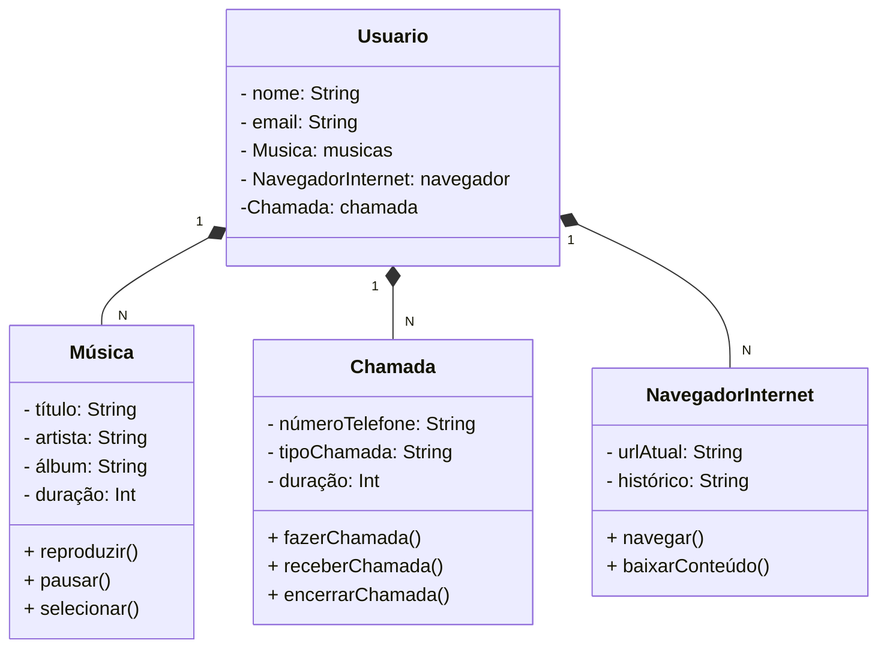

# DiagramaClasseIphone-BancoSantander
## Modelagem e Diagramação de um Componente iPhone

### Reprodutor Musical
* Métodos: tocar(), pausar(), selecionarMusica(String musica)
### Realizar Chamada
* Métodos: ligar(String numero), atender(), iniciarCorreioVoz()
### Navegador na Internet
* Métodos: exibirPagina(String url), adicionarNovaAba(), atualizarPagina()

